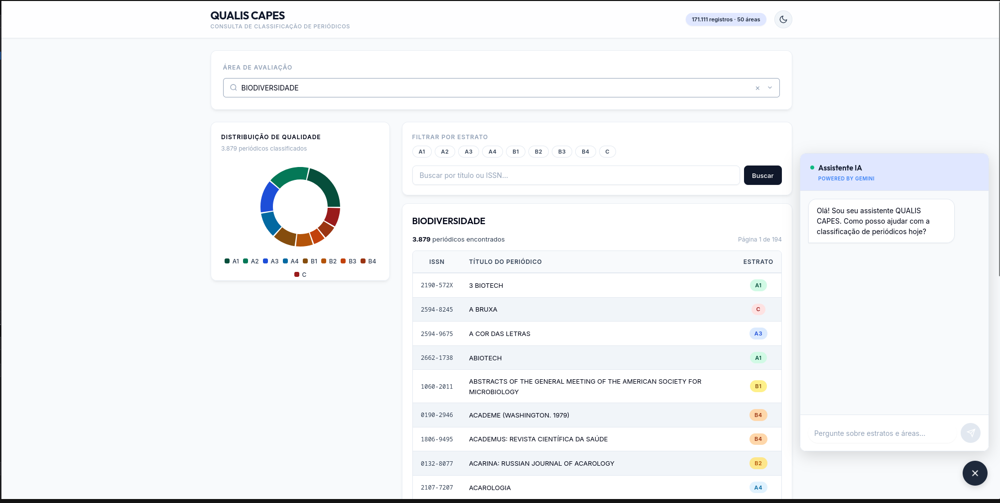
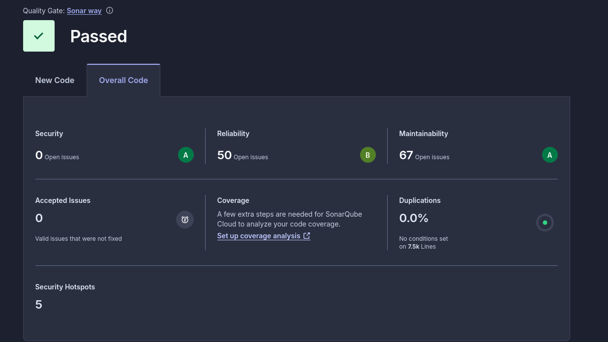
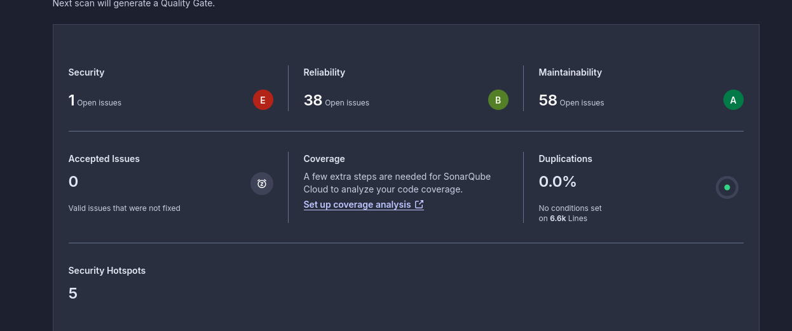

# QUALIS CAPES — Consulta de Classificação de Periódicos

[](https://sonarcloud.io/summary/new_code?id=ronanpjr_qualis_capes)
[](https://sonarcloud.io/summary/new_code?id=ronanpjr_qualis_capes)
[](https://www.python.org/)
[](https://fastapi.tiangolo.com/)
[](https://react.dev/)
[](https://www.postgresql.org/)

Ferramenta completa para consultar e analisar classificações **QUALIS CAPES** de periódicos científicos, permitindo que coordenadores de pós-graduação filtrem por área de avaliação e estrato com eficiência. Integrada com **Google Gemini** para buscas em linguagem natural.

> **Dados:** Classificação de Periódicos — Quadriênio 2021-2024 (Plataforma Sucupira)  
> **Base:** 171.111 registros · 50 áreas de avaliação · Escalas: A1–A4, B1–B4, C




*A interface foi projetada para ser intuitiva e responsiva, oferecendo busca global, filtros avançados, painel de distribuição com gráficos dinâmicos e chat com IA.*


*Nota: O enunciado mencionava a escala antiga (com B5), porém, para refletir fielmente a base de dados oficial do quadriênio 2021-2024 fornecida, o sistema foi adaptado para a escala atual (A1-A4, B1-B4, C).*

## 📚 Índice

- [Features](#-features)
- [Stack Tecnológico](#-stack-tecnológico)
- [Quick Start](#-quick-start--docker)
- [Instalação Detalhada](#-instalação-detalhada)
- [API Endpoints](#-api-endpoints)
- [Decisões Técnicas](#-decisões-técnicas)
- [Arquitetura](#-arquitetura)
- [Testes](#-testes)
- [Segurança](#-segurança)
- [Troubleshooting](#-troubleshooting)
- [Melhorias Futuras](#-melhorias-futuras)
- [Documentação Adicional](#-documentação-adicional)

---

## ✨ Features

| Recurso | Descrição |
|---------|-----------|
| 🔍 **Busca Global** | Filtre instantaneamente por título ou ISSN em 171K+ registros |
| 📊 **Filtros Avançados** | Seleção por área, estrato e combinações múltiplas |
| 📈 **Painel de Distribuição** | Gráficos dinâmicos mostrando perfil de qualidade por área |
| 🤖 **Chat com IA** | Consulta em linguagem natural via Google Gemini (function calling) |
| 📱 **Responsivo** | Interface adaptada para desktop, tablet e mobile |
| 🎨 **Design Institucional** | Cores e tipografia alinhadas a portais acadêmicos (USP, UNICAMP) |
| 🔐 **Segurança** | Rate limiting, SQL parametrizado, CORS restrito, headers de segurança |
| ✅ **Quality Gate** | SonarQube Cloud — 0 issues de segurança, Quality Gate Passed |
| 📝 **Logging** | Auditoria completa de requisições com IP, parâmetros e erros |

---

## 🏗️ Stack Tecnológico

| Camada | Tecnologia | Versão |
|---|---|---|
| **Backend** | Python + FastAPI + SQLAlchemy | 3.12 / 0.115 / 2.0 |
| **Banco de Dados** | PostgreSQL + pg_trgm (Full Text Search) | 16 Alpine |
| **Frontend** | React + Vite + Recharts | 19 / 8.0 / 3.8 |
| **IA** | Google Gemini (function calling) | gemini-2.5-flash |
| **Infraestrutura** | Docker + Docker Compose | Latest |
| **Qualidade** | SonarQube Cloud, Pytest | v9.0+ |

---

## 🚀 Quick Start — Docker

A forma mais rápida e recomendada para rodar tudo (BD, API, Frontend):

```bash
# 1. Clone
git clone <repo-url>
cd agora_sabemos

# 2. Configure (necessário para Gemini API)
cp .env.example .env
# Edite .env e adicione GEMINI_API_KEY (obtenha em https://aistudio.google.com/apikey)

# 3. Suba infraestrutura completa
docker compose up --build -d

# 4. Popule banco (uma única vez)
docker compose exec backend python load_data.py

# ✅ Pronto! Acesse:
# Frontend:   http://localhost:5173
# API Docs:   http://localhost:8000/docs
# Health:     http://localhost:8000/health
```

Para parar:
```bash
docker compose down
```

Para logs em tempo real:
```bash
docker compose logs -f backend
docker compose logs -f frontend
```

---

## 🔧 Instalação Detalhada

### Opção 1: Setup Manual (Desenvolvimento Local)

#### 1️⃣ Pré-requisitos
- Python 3.12+
- Node.js 18+
- PostgreSQL 16+ (ou Docker apenas para DB)
- Chave Google Gemini

#### 2️⃣ Banco de Dados

**Com Docker (Recomendado):**
```bash
docker compose up -d postgres
# Aguarde até que a porta 5432 esteja acessível
```

**Ou local:**
```bash
# Crie banco manualmente
createdb qualis_db
```

#### 3️⃣ Backend

```bash
cd backend

# Ambiente virtual
python -m venv venv
source venv/bin/activate  # Linux/Mac
# ou
venv\Scripts\activate  # Windows

# Dependências
pip install -r requirements.txt

# Configure .env
cp ../.env.example .env
# Edite e preencha GEMINI_API_KEY, POSTGRES_* ...

# Carga inicial de dados
python load_data.py

# Inicie servidor
uvicorn main:app --reload --port 8000

# Docs interativa: http://localhost:8000/docs
```

#### 4️⃣ Frontend

```bash
cd frontend

# Dependências
npm install

# Configure variáveis de ambiente
echo "VITE_API_URL=http://localhost:8000" > .env.local

# Dev server (hot reload)
npm run dev

# Acesse: http://localhost:5173
```

---

## 📡 API Endpoints

### 1. Listar Áreas

```http
GET /api/areas
```

**Response (200 OK):**
```json
[
  "ADMINISTRAÇÃO PÚBLICA",
  "AGRONOMIA",
  "ANTROPOLOGIA",
  "ARQUITETURA E URBANISMO",
  ...
]
```

---

### 2. Buscar Periódicos

```http
GET /api/periodicos?area=COMPUTACAO&estrato=A1&search=nature&page=1&per_page=30
```

**Query Parameters:**
- `area` (string, opcional): Filtra por área exata
- `estrato` (array, opcional): Filtra por estrato(s) — `A1`, `A2`, `A3`, `A4`, `B1`, `B2`, `B3`, `B4`, `C`
- `search` (string, opcional): Busca em título ou ISSN (case-insensitive, máx 200 chars)
- `page` (int, default 1): Número da página
- `per_page` (int, default 30, máx 100): Resultados por página

**Response (200 OK):**
```json
{
  "items": [
    {
      "id": 1,
      "issn": "0010-4825",
      "titulo": "Nature",
      "area": "BIOLOGIA GERAL",
      "estrato": "A1"
    }
  ],
  "total": 5234,
  "page": 1,
  "per_page": 30,
  "total_pages": 175
}
```

**Erros:**
- `422 Unprocessable Entity`: Área ou estrato inválido
- `404 Not Found`: Nenhum resultado

---

### 3. Distribuição por Área

```http
GET /api/areas/{area}/distribuicao
```

**Response (200 OK):**
```json
{
  "area": "COMPUTACAO",
  "total": 2341,
  "distribuicao": [
    {
      "estrato": "A1",
      "count": 245,
      "percentual": 10.47
    },
    {
      "estrato": "A2",
      "count": 312,
      "percentual": 13.32
    }
  ]
}
```

**Erros:**
- `404 Not Found`: Área não existe ou sem dados

---

### 4. Chat IA

```http
POST /api/chat
Content-Type: application/json

{
  "message": "Quantos periódicos A1 tem na área de COMPUTAÇÃO?"
}
```

**Response (200 OK):**
```json
{
  "response": "Na área de COMPUTAÇÃO, existem 245 periódicos classificados como A1...",
  "data": [
    {
      "id": 1,
      "issn": "0010-4825",
      "titulo": "Nature Computing",
      "area": "COMPUTACAO",
      "estrato": "A1"
    }
  ],
  "action_taken": "search_periodicos"
}
```

**Rate Limit:** 10 req/min por IP  
**Erros:**
- `503 Service Unavailable`: Gemini API indisponível
- `422 Unprocessable Entity`: Mensagem inválida (>500 chars)

---

### 5. Health Check

```http
GET /health
```

**Response:**
```json
{
  "status": "ok"
}
```

---

## 🏛️ Decisões Técnicas

### 1️⃣ **Por que PostgreSQL + Docker Compose?**

**A Análise:**
- Base tem 171.111 registros e 50 áreas → escalável
- Requisita performance, índices, full-text search
- Ambiente de produção requer containerização

**Alternativas Rejeitadas:**
- ❌ SQLite: Adequado, mas não reflete produção real
- ❌ MongoDB: Overkill para schema relacional simples
- ❌ setup manual: Complexo, não reproduzível

**Benefício:** Demonstra capacidade com banco production-grade e orquestração de containers.

---

### 2️⃣ **Por que Híbrido ORM + Raw SQL?**

**SQLAlchemy ORM:**
- Definição de modelos (models.py)
- Gerenciamento de sessão e transactions
- Type safety e autocomplete

**Raw SQL Parametrizado:**
- **Window Functions** (`COUNT(*) OVER()`) para paginação eficiente em 1 query vs 2
- **CASE WHEN** para ordenação semântica de estratos (A1 → C)
- **ILIKE com índice pg_trgm** para busca textual rápida
- **Proteção:** Parameterização via `:param` evita SQL injection

**Exemplo:** Em `queries.py`:
```python
# Seguro e eficiente
stmt = select(...).where(and_(*filters))  # SQLAlchemy
result = db.execute(text("SELECT ... WHERE area = :area"), {"area": user_input})  # Raw SQL
```

---

### 3️⃣ **Por que Gemini Function Calling?**

**Alternativas:**
- ❌ Prompt engineering simples: Hallucinations, sem estrutura
- ❌ RAG (Retrieval-Augmented): Complexo, não haveria tempo de implementação aqui
- ✅ Function Calling: O modelo recebe as **tool definitions** (endpoints como JSON) e decide qual chamar

**Fluxo:**
1. Usuário: "Quantos A1 em COMPUTAÇÃO?"
2. Gemini recebe: `[ { name: "search_periodicos", params: {...} }, ... ]`
3. Gemini responde: `{"function_call": "search_periodicos", "args": {...}}`
4. Backend executa a função e retorna resultado real
5. Gemini formata em linguagem natural

**Benefício:** Garantia de consistência, sem alucinações, integração com dados reais.

---

### 4️⃣ **Por que React + Vite?**

- **React 19:** Última versão, melhor performance, RSC (Server Components)
- **Vite:** Build rápido, dev server HMR, suporte nativo a ESM
- **Recharts:** Gráficos simples e acessíveis (vs D3 ou Plotly)

**Alternativas rejeitadas:**
- ❌ jQuery: Obsoleto
- ❌ Vue/Angular: Mais complexos para este escopo
- ❌ Next.js: Overkill para SPA estática

---

### 5️⃣ **Decisões de Segurança**

| Medida | Implementação | Arquivo |
|--------|---|---|
| **SQL Injection** | Parameterização (`:param`) | queries.py |
| **Rate Limiting** | SlowAPI (60/min geral, 10/min chat) | main.py |
| **CORS** | Whitelist de origens explícitas | main.py |
| **Headers** | X-Content-Type-Options: nosniff, X-Frame-Options: DENY | main.py |
| **Logging** | Auditoria de IP, parâmetros, erros | main.py |
| **Input Validation** | Pydantic schemas + Query limits | schemas.py |
| **Wildcard Escape** | Escape de `%`, `_` em buscas ILIKE | main.py |

---

## 🏗️ Arquitetura

```
┌─────────────────────────────────────────────────────────────┐
│                     Frontend (React + Vite)                  │
│  ┌──────────────┬──────────────┬──────────────────────────┐ │
│  │ AreaSelector │ ResultsTable │ DistributionPanel        │ │
│  │ (Dropdown)   │ (Paginada)   │ (Recharts)               │ │
│  └──────────────┴──────────────┴──────────────────────────┘ │
│  ┌──────────────────────────────────────────────────────┐   │
│  │              ChatPanel (IA Flutuante)                │   │
│  └──────────────────────────────────────────────────────┘   │
└─────────────────────────────────────────────────────────────┘
                            ↕ HTTP/REST
┌─────────────────────────────────────────────────────────────┐
│                   Backend (FastAPI)                          │
│  ┌─────────────────────────────────────────────────────┐   │
│  │  main.py — Endpoints + Security Middleware          │   │
│  │  ├─ GET  /api/areas                                 │   │
│  │  ├─ GET  /api/periodicos                            │   │
│  │  ├─ GET  /api/areas/{area}/distribuicao            │   │
│  │  └─ POST /api/chat                                  │   │
│  └─────────────────────────────────────────────────────┘   │
│  ┌─────────────┬──────────────┬──────────────────────────┐  │
│  │ queries.py  │ models.py    │ chat.py                  │  │
│  │ (SQL)       │ (SQLAlchemy) │ (Gemini integration)     │  │
│  └─────────────┴──────────────┴──────────────────────────┘  │
└─────────────────────────────────────────────────────────────┘
                            ↕ SQL + REST
┌─────────────────────────────────────────────────────────────┐
│              PostgreSQL 16 (Docker)                          │
│  ┌───────────────────────────────────────────────────────┐  │
│  │  Table: periodicos (171.111 rows)                      │  │
│  │  ├─ id (PK)                                            │  │
│  │  ├─ issn (indexed)                                     │  │
│  │  ├─ titulo (indexed with pg_trgm)                      │  │
│  │  ├─ area (indexed + FK)                                │  │
│  │  └─ estrato (indexed)                                  │  │
│  └───────────────────────────────────────────────────────┘  │
└─────────────────────────────────────────────────────────────┘
```

### Data Flow

```
1. Usuário interage com UI (Frontend)
   ↓
2. Frontend faz requisição HTTP GET/POST (api.js)
   ↓
3. Rate Limiter valida (SlowAPI)
   ↓
4. Security Middleware adiciona headers
   ↓
5. Endpoint processa:
   - Validação de input (Pydantic)
   - Logging de auditoria
   - Executa query (queries.py ou Gemini)
   ↓
6. Resposta formatada (schemas.py)
   ↓
7. Frontend renderiza (React components)
```

---

## 🔍 Qualidade de Código (SonarQube Cloud)

O projeto é monitorado pelo **SonarQube Cloud** para garantir a manutenibilidade, segurança e confiabilidade do código.



*Estado atual do projeto: ✅ Quality Gate Passed com 0 issues de segurança.*



*Histórico de análise e evolução da qualidade de código.*

### Principais Melhorias Implementadas:
- **Type Safety:** Refatoração completa com type hints em Python (Pydantic/FastAPI) e frontend (JavaScript com JSDoc)
- **Security:** Rate limiting, SQL parametrizado, CORS restrito, headers de segurança, input validation
- **Code Coverage:** Testes unitários (20) + integração (32) cobrindo queries críticas
- **Best Practices:** Logging de auditoria, error handling explícito, separação de concerns

---

## 🧪 Testes

### Executar Suite de Testes

```bash
cd backend
pytest -v                    # Todos os testes com output verbose
pytest -v tests/test_endpoints.py  # Apenas endpoints
pytest -v tests/test_queries.py    # Apenas queries
pytest --cov               # Com cobertura
```

### Testes Incluídos

**32 testes de integração** (`test_endpoints.py`):
- Health check
- Listar áreas
- Buscar periódicos (com/sem filtros)
- Distribuição por área
- Chat IA (validação, rate limit)

**20 testes unitários** (`test_queries.py`):
- `get_areas()` — distinctness, ordenação
- `search_periodicos()` — filtros, paginação, busca, edge cases
- `get_distribuicao()` — estrutura, contagem, percentual

**Banco de testes:** SQLite in-memory isolado por teste, seeds com 9 periódicos

---

## 🔐 Segurança

### Medidas Implementadas

#### 1. **SQL Injection**
✅ Todas as queries usam parameterização (`:param`) via SQLAlchemy ou raw SQL.

```python
# ✅ Seguro
db.execute(text("SELECT * FROM periodicos WHERE area = :area"), {"area": user_area})

# ❌ Inseguro (não usado)
# db.execute(text(f"SELECT * FROM periodicos WHERE area = '{user_area}'"))
```

#### 2. **Input Validation**
✅ Pydantic + FastAPI Query limits

```python
area: Annotated[str | None, Query(max_length=200)] = None
search: Annotated[str | None, Query(max_length=200, strip_whitespace=True)] = None
estrato: Annotated[list[str] | None, Query()] = None
# Validação automática de tipo e tamanho
```

#### 3. **Wildcard Escape (ILIKE)**
✅ Caracteres especiais escapados antes de busca

```python
if search:
    sanitized = search.replace("\\", "\\\\").replace("%", "\\%").replace("_", "\\_")
```

#### 4. **Rate Limiting**
✅ SlowAPI com limite global + específico para chat

```python
@limiter.limit("60/minute")  # Geral
@limiter.limit("10/minute")  # Chat (Gemini API caro)
```

#### 5. **CORS**
✅ Whitelist explícita (não permite `["*"]`)

```python
origins = [
    "http://localhost:5173",
    "http://localhost:3000",
]
if PROD_ORIGIN:
    origins.append(PROD_ORIGIN)
```

#### 6. **Security Headers**
✅ Middleware adiciona headers de proteção

```python
X-Content-Type-Options: nosniff   # Evita sniffing de MIME
X-Frame-Options: DENY             # Evita clickjacking
```

#### 7. **Logging & Auditoria**
✅ Todas as requisições registradas com IP, parâmetros, erros

```python
logger.info(f"GET /api/periodicos from {client_ip} - area={area}, estrato={estrato}, ...")
logger.warning(f"Invalid area requested: {area}")
logger.error(f"Error in chat handler: {str(e)}")
```

#### 8. **Secrets Management**
✅ `.env.example` fornecido; `.env` no `.gitignore`; variáveis de ambiente em produção

---

## 🆘 Troubleshooting

### Problema: "GEMINI_API_KEY não configurada"

**Solução:**
1. Obtenha chave em https://aistudio.google.com/apikey
2. Atualize `.env`:
   ```bash
   GEMINI_API_KEY=sua_chave_aqui
   ```
3. Reinicie o backend:
   ```bash
   docker compose restart backend
   # ou
   python main.py
   ```

---

### Problema: "Erro ao conectar com PostgreSQL"

**Solução:**
1. Verifique se container está rodando:
   ```bash
   docker compose ps
   ```

2. Se não estiver:
   ```bash
   docker compose up -d postgres
   ```

3. Aguarde ~5s e teste conexão:
   ```bash
   docker compose exec postgres psql -U qualis_user -d qualis_db -c "SELECT COUNT(*) FROM periodicos;"
   ```

---

### Problema: "Nenhum resultado na busca"

**Possíveis Causas:**
- Dados não carregados: Execute `docker compose exec backend python load_data.py`
- Filtros muito restritivos: Tente sem filtros
- Área não existe: Verifique em `GET /api/areas`

**Debug:**
```bash
curl http://localhost:8000/api/areas
curl 'http://localhost:8000/api/periodicos?page=1&per_page=5'
```

---

### Problema: "Rate limit exceeded"

**Solução:**
- Espere 1 minuto (geral: 60/min, chat: 10/min)
- Ou mude IP/rede
- Ajuste limite em `main.py` se necessário

---

### Problema: "Frontend não conecta com API"

**Solução:**
1. Verifique `VITE_API_URL` em `.env.local` ou durante build
2. Teste endpoint diretamente:
   ```bash
   curl http://localhost:8000/api/areas
   ```
3. Se CORS error, verifique origem em `main.py`

---

### Problema: "Docker build falha"

**Solução:**
```bash
# Limpe imagens antigas
docker compose down --remove-orphans
docker system prune -a

# Rebuild
docker compose up --build -d
```

---

## ⏳ Melhorias Futuras

### Curto Prazo 

- [ ] **Testes E2E:** Cypress ou Playwright para fluxos completos
- [ ] **Migrations:** Alembic para versionamento de schema
- [ ] **Cache:** Redis ou `@lru_cache` para `/api/areas` (dados estáticos)
- [ ] **Infinite Scroll:** Na tabela de resultados (vs paginação discreta)

### Médio Prazo 
- [ ] **CI/CD:** GitHub Actions para lint, test, deploy automático
- [ ] **Full-Text Search avançado:** Dicionário português, sinônimos
- [ ] **Export:** CSV/Excel dos resultados filtrados
- [ ] **Analytics:** Dashboard de uso (queries mais comuns, áreas populares)

### Longo Prazo 

- [ ] **Comparação entre áreas:** Gráficos de benchmark
- [ ] **Histórico:** Tracking de mudanças de estrato ao longo dos anos
- [ ] **Notificações:** Alerta quando periódico muda de estrato
- [ ] **API Pública:** Documentação OpenAPI para terceiros
- [ ] **Mobile App:** Flutter ou React Native

---

## 📚 Documentação Adicional

| Documento | Propósito |
|-----------|-----------|
| **[ARCHITECTURE.md](docs/ARCHITECTURE.md)** | Detalhes técnicos de design e padrões |
| **[SECURITY_GUIDELINES.md](docs/SECURITY_GUIDELINES.md)** | Práticas de segurança e threat model |
| **[DESIGN_GUIDELINES.md](docs/DESIGN_GUIDELINES.md)** | Paleta, tipografia, componentes UI |
| **[TROUBLESHOOTING.md](docs/TROUBLESHOOTING.md)** | Guia de problemas e soluções (expandido) |

---

## 📄 Licença

Projeto acadêmico — uso educacional.

---

## 📧 Contato

Desenvolvido como avaliação técnica para **Agora Sabemos** — Processo seletivo Estágio em Desenvolvimento Back-end e Data Engineering.

---

**Última atualização:** March 16, 2026  
**Status:** ✅ Produção (Quality Gate Passed)
